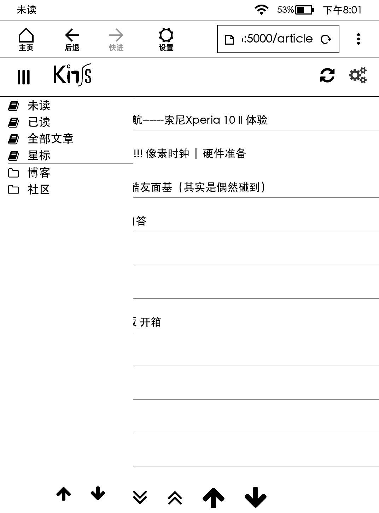
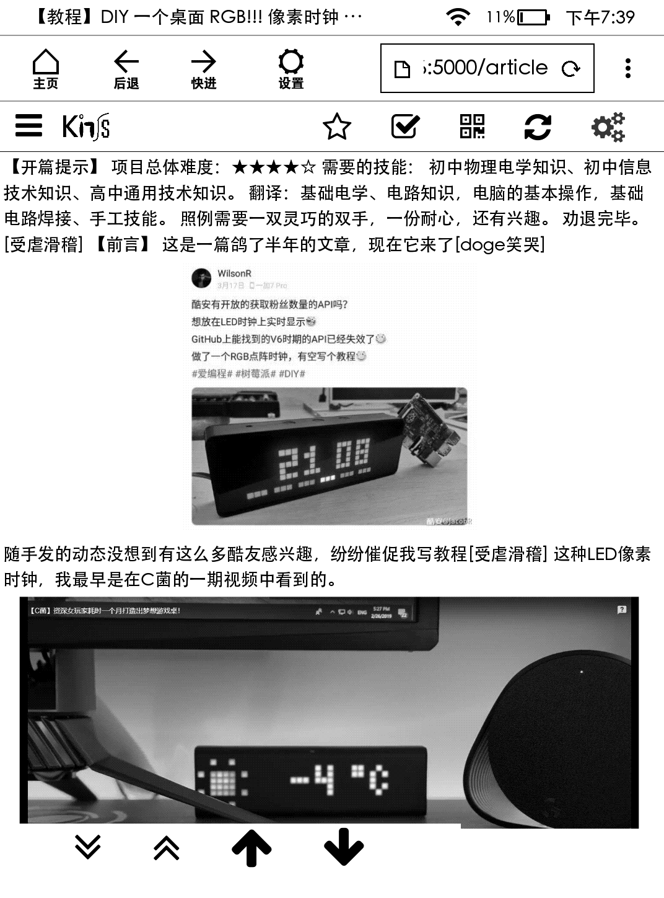

## About Kinss
Kinss is a minimalist feed reader for kindle.

## Quickstart
1. `pip install -r requirements.txt`
2. 运行`app.py`，默认 ip 是 `0.0.0.0` & 端口 `5000`。
3. 此程序依赖于[miniflux](https://github.com/miniflux/miniflux)，请先根据[手册](https://miniflux.app/docs/installation.html)完成安装并配置好信息后使用。访问网页后，进入设置页面设置miniflux服务器地址，在登录页面输入您的miniflux用户名和密码。
4. 体验地址：[kinss](http://kindle.2333332.xyz)，除了设置，其他都可用。用户名和密码均为`kinss`。当然，由于网络问题，反应可能有点慢。

## Features
- [x] 已读/未读
- [x] 星标
- [x] 二维码
- [x] 分类
- [ ] UI美化
- [ ] 原文

## Read On KPW3

## License
Kinss is open-sourced software licensed under the [MIT license](https://opensource.org/licenses/MIT).
